 

---

## `$ whoami`

  

## `$ cat tech-stack.yaml`

<table border="1" cellpadding="14" bgcolor="#17171c">
  <thead>
    <tr>
      <th colspan="2" align="left"><code>mailen:~$ cat tech-stack.yaml</code></th>
    </tr>
  </thead>
  <tbody>
    <tr>
      <td width="50%" valign="top"><code>├─ ✦ languages:</code>  
         
        <code>Python · R · JavaScript</code>
      </td>
      <td width="50%" valign="top"><code>├─ ◈ web:</code>  
         
        <code>HTML · CSS · JavaScript</code>
      </td>
    </tr>
    <tr>
      <td valign="top"><code>├─ ⌘ editors:</code>  
        
         
        <code>VS Code · RStudio</code>
      </td>
      <td valign="top"><code>╰─ ◉ focus:</code>  
        <code>Ciencia de Datos · Universidad Austral</code>
      </td>
    </tr>
  </tbody>
  <tfoot>
    <tr>
      <td colspan="2"><code>status: ready&nbsp;&nbsp;·&nbsp;&nbsp;environment: learning</code></td>
    </tr>
  </tfoot>
</table>

---
